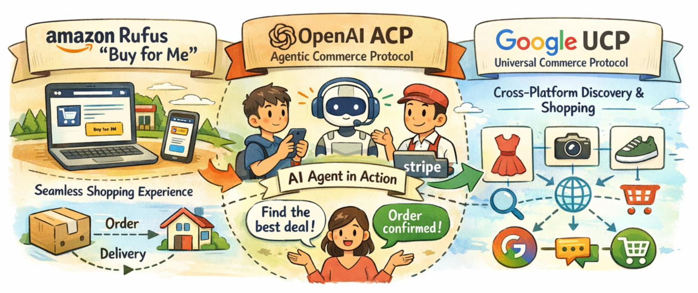
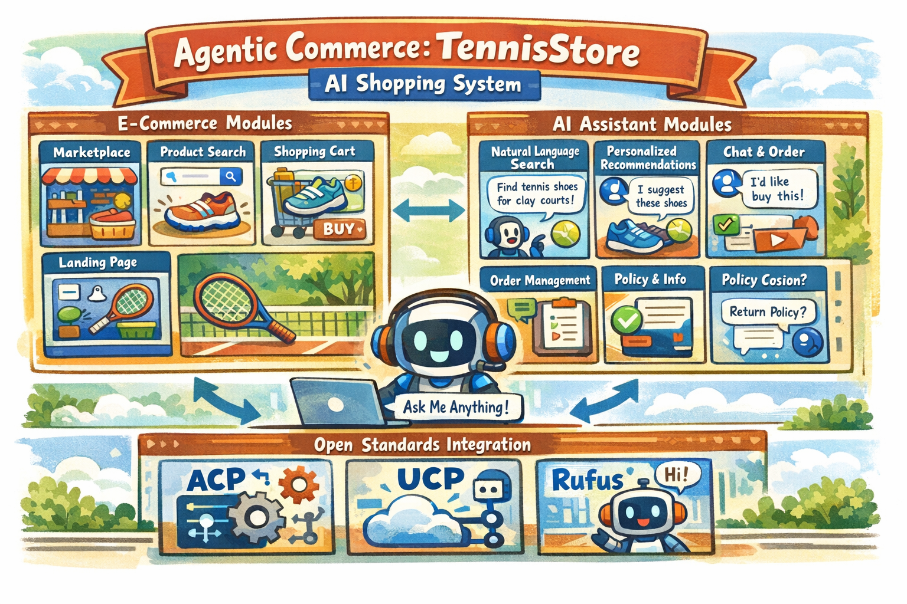
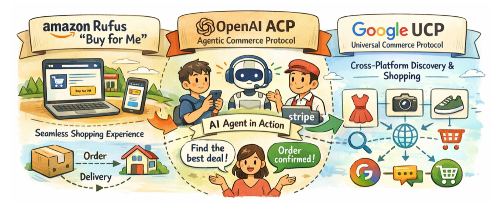

# 不只是 Chatbot：如何设计一个真正可执行的 Agentic Commerce 电商系统

> 如果 AI 只能给建议，而不能在真实交易约束下完成下单，那么所谓的“商业闭环”并不存在。

过去几年，AI 在电商领域的应用发展迅速：商品文案生成、图片生成、智能客服、推荐与分析能力已经相当成熟。然而，一个关键问题始终没有被系统性回答清楚：

**AI 能否在真实电商规则与约束下，持续推进并完成一次完整交易？**

本文将结合行业趋势（ACP-Agentic Commerce Protocol / UCP-Universal Commerce Protocol / Rufus 等平台整合路径），并通过一个可运行的原型系统，探讨 **Agentic Commerce** 作为一种**系统能力**，应该如何被设计、实现与验证。

# 核心问题：AI 是否真的能完成交易？

当前绝大多数 AI 电商应用，本质上仍停留在“生成与建议”阶段。它们可以生成商品文案、回答咨询问题、做推荐与分析，但这些能力大多运行在**无状态（stateless）**的交互中。

而真实的电商交易天然是一个**有状态、有约束、且存在失败路径的流程**：库存是否可用、地址是否完整可配送、税费与配送如何计算、支付是否成功，以及交易是否需要取消或回滚。如果 AI 无法在这些约束下持续推进流程、处理失败并恢复状态，它始终只是一个“给建议的助手”，而无法成为商业系统中的“行动参与者”。

这也引出了一个常见但容易被误解的问题：**Chatbot 与 Agentic Commerce 是否对立？**
Chatbot 是一种**交互形态**，而 Agentic Commerce 是一种**系统能力**。后者既可以呈现在聊天界面中，也可以运行在后台系统里。真正的关键不在于对话是否足够聪明，而在于系统是否真正允许 AI 执行动作，协议是否清晰定义能力与边界，以及责任是否能够被拆分、追踪与控制。

# 行业信号：Agentic Commerce 正在走向协议化与系统化

在构建这个 Agentic Commerce 原型的过程中，行业几乎同步给出了清晰信号：**AI 正在从“推荐者”走向“行动者”，而商业系统正在为此重新设计。**

- **Amazon Rufus 的 “Buy for Me”**代表**平台整合路径**：在自有生态内完成从发现、决策到支付的端到端闭环，追求极致顺滑的一体化体验
- **OpenAI ACP（Agentic Commerce Protocol）**聚焦**执行层**：这是 OpenAI 和 Stripe 联合推出的开放标准协议，解决 AI Agent 如何在对话中安全、可控地代表用户完成下单与支付
- **Google UCP（Universal Commerce Protocol）**站在更**上游的发现与互操作层**：关注商品数据与购物能力如何以统一标准向 Agent 开放，支持跨平台的理解、发现与购买

从这个角度看，Agentic Commerce 已经不再停留在概念阶段，而是正在进入**协议化、系统化的实践阶段**。

# 设计原则：Agentic Commerce 关键不在“更聪明”，而在“能行动”

Agentic Commerce 不是营销名词，而是一种**系统能力**：**AI Agent 能否在明确的协议与约束下，代表用户或商家完成真实的商业动作。**

要让这件事成立，至少需要三项“最小但关键”的能力：

1. **商品数据对 Agent 友好**：可被机器理解与消费（例如标准化字段、可检索、可结账标识）
2. **结账流程可被安全调用**：不是靠隐式逻辑，而是明确的状态机与接口
3. **交易过程可追踪、可恢复、可取消**：具备完整失败路径与幂等保障

这也是我选择以 **“开放标准 + 可运行原型”** 的方式来做这个项目的原因：我不想只做一个能聊的 Demo，而是想验证 **“AI 真的能把交易推进到最后一步”**。

# 系统设计：一个真正可运行的 Agentic Commerce 原型

围绕上述目标，我实现了一个可运行的 **TennisStore：AI 智能导购电商系统**。它同时覆盖：

- **电商基础链路**（商城/商品/搜索/购物车/落地页）
- **智能导购链路**（自然语言搜索、推荐、聊天下单、订单管理、政策咨询）
- **集成开放标准协议**（ACP、UCP、Rufus）

## **架构总览**

为了让系统既能跑通体验，又能持续演进，我将解耦为三层架构：

1. **交互层（Interaction Layer）**

**Next.js - Web + Chat UI + Payment UI**

- Web 侧提供商品列表、搜索、详情、购物车，承接“获客 → 转化”
- Chat UI 承接“咨询 → 推荐 → 确认 → 下单”的对话链路
- Payment UI 在聊天内渲染订单卡片、费用明细、配送选择与支付动作，让交易关键节点可确认、可追踪

1. **Agent 层（Agent Orchestration Layer）**

**Strands Agents - 多 Agent 协作模式**
采用 Coordinator Agent 作为主协调器，根据用户意图路由到不同 Sub-Agent，形成“对话 → 任务拆解 → 工具调用”的执行链路（示例：客服、结账、商品信息、推荐、政策咨询等）。

1. **协议层（Execution & Protocol Layer）**

**REST API + Agent Tools 双入口**

- 对内：将交易动作封装为 Agent Tools（checkout / order / product），使得 Agent 的调用稳定和结构化
- 对外：暴露符合 ACP/UCP 风格的 REST API（checkout_sessions、feed 等），为未来接入 ChatGPT / Gemini 等第三方 AI 平台预留标准化路径

**核心思想是：交互体验可以持续演进，但协议化能力应当保持稳定并可复用。**

# 写在最后：从“对话”到“可负责的交易”

无论是 **ACP**、**UCP**，还是 Amazon 的 **Buy for Me**，它们共同释放的信号非常明确：**AI 正在从“给建议的助手”，走向“可以直接行动的参与者”。**而一旦 AI 被允许执行下单、支付、履约等真实操作，问题的核心就不再是模型是否足够聪明，而是：

- **系统是否真正允许 AI 行动**
- **协议是否清晰地定义了能力与边界**
- **责任是否能够被拆分、追踪与控制**

这正是我构建这个 **Agentic Commerce 原型**最想验证的一点：**当对话不再停留在推荐层，而是能够持续推进并完成一笔真实交易，AI 才第一次具备了完整、可验证的商业意义。**

Agentic Commerce 的本质，不是“更像人聊天”，而是 **是否真的能把一次对话，变成一次可完成、可负责、可复盘的交易。**

# 其他

博客已发布在

- aws 中国官方博客：[https://aws.amazon.com/cn/blogs/china/beyond-chatbot-how-to-design-a-truly-executable-agentic-commerce-ecommerce-system/](https://aws.amazon.com/cn/blogs/china/beyond-chatbot-how-to-design-a-truly-executable-agentic-commerce-ecommerce-system/)
- 知乎：[https://zhuanlan.zhihu.com/p/1994713934872220361](https://zhuanlan.zhihu.com/p/1994713934872220361)

- 36 氪：[https://36kr.com/p/3638465148685696](https://36kr.com/p/3638465148685696)，评论区引流
- 虎嗅：[https://www.huxiu.com/article/4826272.html](https://www.huxiu.com/article/4826272.html)，评论区引流
