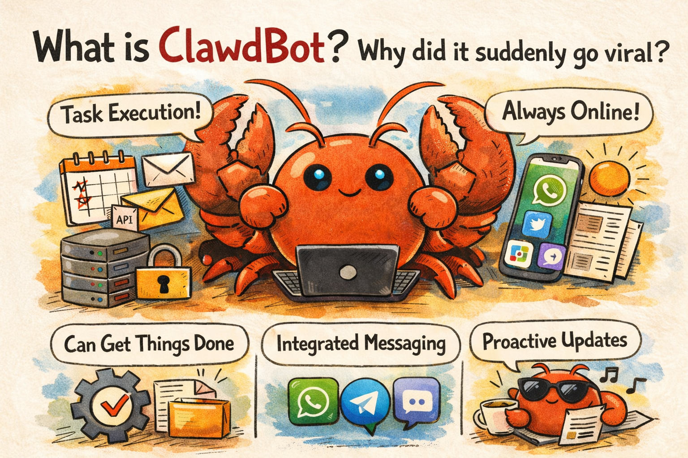
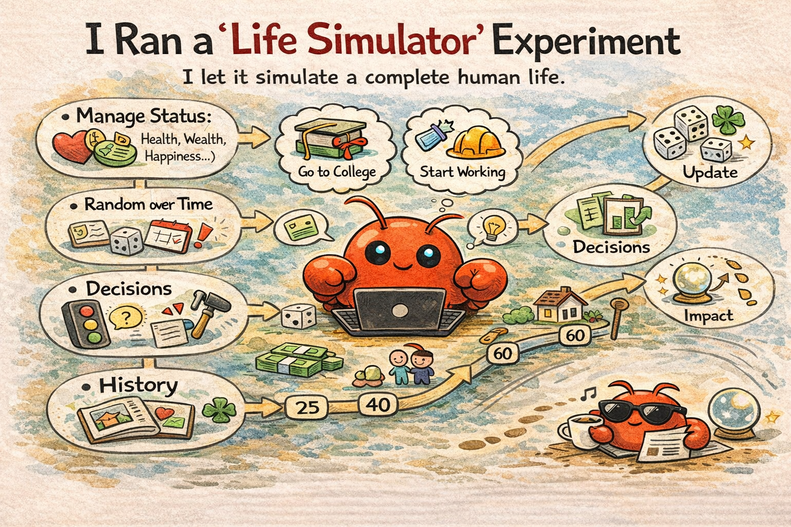
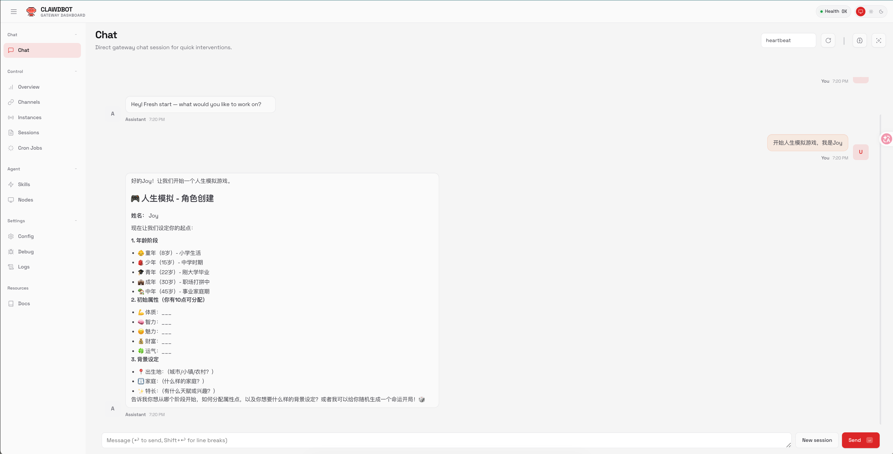

# Clawdbot 为何爆火? 我用它来"模拟人生"

2026 年初，一个名为 Clawdbot / Moltbot 的开源 AI 助手项目突然刷屏开发者社区。

短时间内获得大量关注，经历改名风波，被疯狂二创，甚至衍生出“AI 社交网络”等各种玩法。很多人把它当成又一个 AI Demo，但它的爆火并不是偶然，而是踩中了 AI 从“聊天工具”走向“执行系统”的关键节点。

本文将结合我的实际体验和一次“人生模拟器”实验，重点解释三个问题：

1. 什么是 OpenClaw？为什么一夜爆红？
2. OpenClaw vs Manus vs Claude Code：三种 Agent 路线异同
3. ClawdBot 部署“人生模拟器”，实验结果如何？

如果你正在关注 AI Agent、自动化系统或下一代软件形态，这些问题，都会在文中给出答案。

# 一、什么是 OpenClaw？为什么一夜爆红？



**ClawdBot / Moltbot 是什么？**

在理解这波爆火之前，首先需要明确 Clawdbot 是什么。在项目迅速走红后不久，应 Anthropic 公司申请，该项目更名为 Moltbot ，以避免与其 Claude 品牌的 AI 产品混淆。

它并不是一个普通的聊天机器人，而是一个**开源的自主 AI 助手系统**，核心目标不是生成回答，而是代表用户**执行真实任务**。OpenClaw 支持**本地或私有化部署**，可通过 WhatsApp、Telegram、Slack 等高频消息工具交互，并能接入日历、邮箱、文件系统和各类 API，持续保存上下文和历史状态，支持长期运行与自动触发任务。换句话说，它更像一个“住在聊天工具里的数字员工”，而不是升级版 Chatbot，这也正是它与其他 AI 产品最本质的区别。

**OpenClaw 为什么爆火？**

本质上源于它精准击中了“AI 只能聊天、不能做事”的长期痛点。相比传统助手只能给建议，它真正打通了“理解 → 执行”的闭环，能发邮件、管日历、查文件、做提醒，被很多人称为“能动手的 Claude”。同时，它没有做新的应用入口，而是直接嵌入 WhatsApp、Telegram、Discord 等高频聊天工具，让 AI 成为日常对话的一部分，极大降低了使用门槛。更重要的是，它具备持续运行和主动服务能力，可以定时推送行程、天气和资讯，从“被动问答”升级为“数字助理”。再叠加改名风波和龙虾 meme 带来的传播效应。争议即流量。

# 二、OpenClaw vs Manus vs Claude Code：三种 Agent 路线

很多人会把 OpenClaw、Manus、Claude Code 混在一起讨论，其实三者定位非常不同。

放在一起看更清楚：
| 维度 | OpenClaw | Manus | Claude Code |
|------|----------|-------|-------------|
| 核心定位 | 个人 AI 助手 | 通用任务自动化 | 编程协作工具 |
| 主要入口 | 消息平台 | Web / API | 终端 / IDE |
| 目标用户 | 普通用户 / 知识工作者 | 团队 / 企业 | 开发者 |
| 侧重点 | 日常事务执行 | 复杂工作流 | 代码生产力 |
| 主动性 | 中高 | 高 | 较低 |

# 三、我用它跑了一个“人生模拟器”



既然 ClawdBot / Moltbot 能 24/7 运行、主动推送、有持久记忆，**为什么不让它模拟一个完整的"人生"**？为了验证其是否真正具备“长期执行”的 Agent 能力，我做了一个有趣的应用：人生模拟器。

**核心设定：**

- 模拟一个虚拟角色从出生到终老的完整人生
- 每年随机触发事件，影响健康、智力、财富、幸福等属性
- 关键节点需要做出人生选择
- 最终根据属性总分评定人生等级

**交互方式：**

- 发送"开始游戏，角色叫小明"创建角色
- 发送"下一年"推进时间
- 在决策点选择不同路径，或让其自行模拟多种决策

**示例对话：**

```
**我：**开始游戏，角色叫小明

**Moltbot：**
📅 1990年 - 小明 0岁

🎒 一个新生命来到了这个世界！

【出生事件】
- 出生在一个普通的工薪家庭
- 父亲是工程师，母亲是教师

【初始属性】
❤️ 健康：100/100
🧠 智力：58
✨ 魅力：45
💰 财富：0
😊 幸福：85/100
⭐ 声望：0

发送"下一年"开始你的人生旅程...
```

```
**我：**快进到18岁

**Moltbot：**
📅 2008年 - 小明 18岁

【重大事件】高考来临！

过去18年回顾：
- 5岁：学会骑自行车 (健康+5)
- 8岁：获得奥数三等奖 (智力+10)
- 12岁：初恋，被拒绝 (幸福-10，魅力+5)
- 15岁：中考全市前100 (智力+15，声望+10)
- 17岁：生了一场大病 (健康-20)

【当前状态】
❤️ 健康：85/100
🧠 智力：83
✨ 魅力：52
💰 财富：0
😊 幸福：70/100
⭐ 声望：15

⚠️ 人生抉择时刻！

请选择：
A. 冲刺清华北大（需要智力>80）
B. 报考普通一本，稳妥为主
C. 出国留学（需要财富>50 或 贷款）
D. 放弃高考，直接工作
```

**为什么这个 demo 有意思？**

- **展示持久记忆**：角色的历史事件会被记住
- **展示主动推送**：可以设置每天自动推进一年
- **展示多平台**：在 WhatsApp 上玩，随时随地
- **有趣且易理解**：非技术人员也能体验 AI Agent 的能力

# 四、通过 Amazon Bedrock 安全部署

早期 ClawdBot / Moltbot 主要基于 Anthropic / OpenAI 官方 API 接入模型。由于其需要长期自主运行，通常需要访问用户的邮件、日历、即时通讯工具等敏感系统，因此在权限管理和安全边界方面，也受到安全研究人员的持续关注。

本次实验采用基于 Amazon Bedrock 的部署方式：

- 通过 IAM Role 实现细粒度权限控制
- 结合 CloudTrail 进行全链路审计
- 配合 VPC Endpoint 实现私网访问与隔离
- 借助 Cost Explorer 进行成本治理

在保证自动化能力的同时，将 Agent 纳入可治理、可审计的体系之中，适合需要长期运行和合规管理的使用场景。完整部署细节已整理在 GitHub，感兴趣可参考：。



# 五、写在最后

Clawdbot / OpenClaw 的爆火，本质不是偶然。它提前展示了一个趋势：

> AI 正在从“聊天工具”进化为“执行代理”。

下一阶段，真正拉开差距的，不是谁模型更强，而是谁更懂系统设计、治理能力与长期运行。

这，才是 Agent 时代的核心竞争力。
