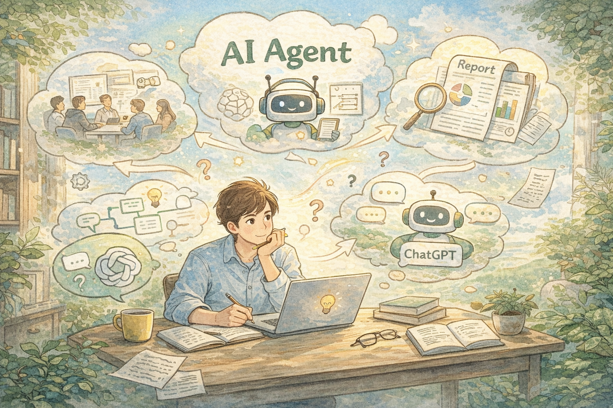
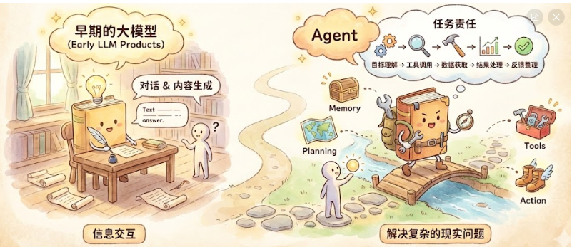
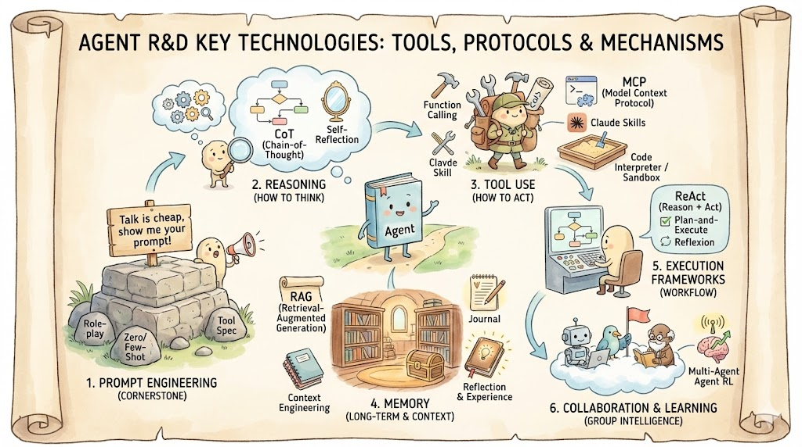

# 普通人如何快速入门 AI Agent？一篇讲清楚背景现状与工程原理

这两年，AI Agent 这个词出现得越来越频繁。

在技术社区、产品论坛，甚至一些行业报告里，都能看到它被反复提及。但很多读者心里其实都有一个疑问： Agent 到底是什么？它和我们熟悉的 ChatGPT 有什么本质区别？普通人学习它，有现实意义吗？ 这篇文章，我尝试抛开营销语言，用更接近学术共识和工程实践的方式，把这些问题系统梳理清楚。



## 一、从经典定义说起：什么是 Agent？

在人工智能领域，对 Agent 最常被引用的定义，来自 Russell 和 Norvig 的教材《Artificial Intelligence: A Modern Approach》：

> An agent is anything that can be viewed as perceiving its environment through sensors and acting upon that environment through actuators.

也就是说，Agent 是一个能够感知环境，并通过行动影响环境的系统。 这个定义强调了一个关键点：Agent 不是“更聪明的聊天机器人”，而是一个具备感知与执行能力的完整系统。在当前以大型语言模型为基础的工程实践中，AI Agent 是一个软件系统，它以 LLM 作为核心大脑，并通过一系列架构组件来赋予其自主行动的能力。可以用一个简单公式记住什么是 Agent：

**AI Agent = LLM (Reasoning) + Planning + Memory + Tool Use**

笔者于 2026 年初记录下这篇文章，距今为止，行业普遍认为 2025 年是 Agent 元年

---

## 二、从“会说话”到“能干活”：Agent 的核心能力拆解

早期的大模型产品，大多集中在“对话”和“内容生成”层面。你提问，模型回答，本质仍然是信息交互。而 Agent 的变化在于，它开始承担“任务责任”。当用户提出一个目标时，Agent 系统往往需要完成：目标理解、工具调用、数据获取、结果处理和反馈整理等一系列步骤。 为了让 LLM 这个大脑能够解决复杂的现实问题，我们需要为它配备记忆（Memory）、思考能力（Planning）、手脚（Tools）以及行动机制（Action），这就是一个普通的 Agent 全貌。



- Planning（从“直觉”到“逻辑”）：是指 Agent 将一个宏观抽象的目标拆解为一系列可执行的子任务，并根据环境反馈动态调整策略的过程。
- Memory（突破上下文限制）：Memory 是 Agent 存储、检索和管理信息的机制，它决定了 Agent 能在多大程度上利用过去的交互历史和外部知识。
- Tools（连接数字世界的接口）：Tools 是 Agent 的“扩展能力”。LLM 仅受限于预训练数据，而 Tools 让它可以联网、计算、绘图甚至控制物理设备。
- Action（从决策到执行）：Action 是规划和工具使用的最终落脚点，是 Agent 对环境产生的实际影响。

---

## 三、工程视角下的 Agent 结构

一个真正可落地的 Agent，本质上不是“更聪明的 Chatbot”，而是一套被工程化约束过的智能系统。它至少需要具备多方核心能力。下面针对 Agent 研发涉及的关键技术点进行重点介绍，形式包括工具、协议、机制等等。



### **提示词工程（Prompt Engineering）—— “智能体地基” **

提示词工程，是 Agent 系统的第一性原理。它不是自然语言对话，而是**通过结构化的文本指令，将非确定性的 LLM 输出约束为可控的软件接口**。

关键优化点包括：

- 角色与职责定义（Role）
- Zero/Few-Shot 示例
- 输出格式约束（JSON / Schema）
- 工具调用规范（Tool Spec）

用一句名人名言总结：

> Talk is cheap, show me your prompt！

### **基础推理能力（Reasoning）—— “如何思考” **

默认状态下，大模型更像“直觉型选手”，倾向于直接给答案。Agent 系统必须强制它进入“慢思考模式”。核心目标是：**把直觉回答，转化为可解释、可拆解的推理过程。**涉及多环节计算、规则判定和路径规划的复杂问题，逐步逼近人类式思维。

实现上述目标的关键机制包含：

- 思维链 (CoT, Chain-of-Thought)

通过在提示词中加入引导（如 “Let’s think step by step”），促使 LLM 显式地生成一系列中间推理步骤，而不是直接输出最终答案。其他演进还有思维树 Tree-of-Thought 和思维图 Graph-of-Thought。

- 自我反思 (Self-Reflection)：

在提示词里要求 Agent 在生成初步结果或采取行动后，暂时跳出当前任务视角，扮演一个独立的“批评者”角色，自动进行“复盘”：推理是否合理？行为是否有效？是否存在偏差？再基于反思结果进行修正。

### **工具扩展能力（Action / Tool Use）—— “如何行动” **

**没有工具的 Agent，只是高级聊天机器人。工具能力决定了 Agent 能否真正“进入现实世界”。**

核心机制包含：

- **Function Calling**

这是当下大模型能够与外部系统交互的主要机制。开发者提供可用函数（工具）的结构化定义（Schema），包括函数名、功能描述、参数列表及其约束，大模型在对话过程中分析用户意图，如果判断需要使用工具，则不直接生成文本，而是输出一个包含目标函数名和参数值的结构化调用请求。宿主程序拦截此请求，执行实际函数，并将结果反馈给大模型，大模型据此生成最终响应。

- **Model Context Protocol (MCP)**

一种标准化的开放协议，旨在统一大模型 Agent 与外部世界（包括数据源、工具集、或其他 Agent）的交互方式。它定义了一套通用的消息格式和接口规范，使得 Agent 能够以一致的方式发现、连接和操作异构的外部资源，降低了集成复杂系统的难度和成本。

下面是通过 MCP 协议连接电商企业退换货政策知识库的示例代码，Agent 可以在运行时动态发现并调用外部工具，无需硬编码集成逻辑：

```python
from strands import Agent
from strands.tools.mcp import MCPClient
from mcp import stdio_client, StdioServerParameters

============================================
1. 创建 MCP Client - 连接外部工具服务
============================================
MCP 支持多种传输方式：stdio（本地）、HTTP（远程）
client = MCPClient(
    lambda: stdio_client(
        StdioServerParameters(
            command="uvx",  # 使用 uvx 自动下载运行 MCP Server
            args=["awslabs.bedrock-kb-retrieval-mcp-server@latest"],
            env={
                "KNOWLEDGE_BASE_ID": "your-kb-id",
                "AWS_REGION": "us-east-1",
            },
        )
    )
)
client.start()

============================================
2. 工具发现 - MCP 的核心能力
============================================
Agent 无需预先知道工具细节，运行时动态发现
tools = client.list_tools_sync()
返回: [QueryKnowledgeBases, ListKnowledgeBases, ...]
每个工具包含: name, description, inputSchema

============================================
3. 注册到 Agent - 统一的工具调用接口
============================================
agent = Agent(
    model="us.anthropic.claude-sonnet-4-5-20250929-v1:0",
    tools=tools,  # MCP 工具自动转换为 Agent 可用格式
)

Agent 会根据用户问题自动选择并调用合适的工具
response = agent("What is the return policy?")
```

- **Claude Skills**

由 Anthropic 提出的模块专业化机制，允许为模型“安装”特定领域的专家能力包。每个 Skill 是一个独立的文件夹，包含领域知识、工具定义、行为规范和使用说明（通常以 SKILL.md 文件形式存在）。通过加载 Skill 让 LLM 可在不微调的情况下，快速转变为高精度和高可靠性的任务专家，显著提升在垂直场景中的性能与可控性。

- **代码解释器 (Code Interpreter / Sandbox)**

为 LLM 提供一个安全的、隔离的编程环境（沙箱）。LLM 可以针对计算密集型或数据处理任务编写代码（通常是 Python），并将其发送到沙箱中执行。沙箱运行代码后，将标准输出、错误信息或生成的文件（如图表）返回给 LLM。这极大地扩展了 LLM 处理数学计算、数据分析和可视化的能力。

### 记忆与知识管理（Memory）—— “长期记忆与上下文”

企业级 Agent，必须具备“可积累经验”的能力。否则，每一次对话都是失忆式重来。

为 Agent 构建一个可持久化、可检索的存储系统，整合内部外部知识，实现跨会话、跨任务的记忆能力，让 LLM 在“知道什么”和“记得什么”之间无缝切换。

从工程视角看，Agent 的记忆系统通常分为三个层级。

**（1）短期记忆 Short-term Memory：上下文窗口**

负责在多轮会话交互中**维护和管理对话状态**。由于大模型的上下文窗口有限，不能无限累加历史信息，所以需要采用策略来决定保留哪些关键信息、丢弃哪些冗余信息，或如何对历史信息进行压缩摘要，以确保 Agent 在多轮对话中保持连贯的认知和目标。典型信息包括：**当前目标、已完成步骤、最近的工具调用结果和关键中间结论**。特点是**存在于 Prompt 中、生命周期短、容量有限、易被覆盖**。所以工程挑战在于如何在有限窗口内，保留最有价值的信息。这正是 Context Engineering 的核心问题。

**（2）长期记忆 Long-term Memory：可检索知识库 RAG（Retrieval-Augmented Generation）**

长期记忆，是 Agent 的“外置大脑”，通常由数据库 + 向量检索系统构成。最典型的实现方式是 RAG，这是一种结合了信息检索和语言生成的技术框架。它通过将外部私有知识库（文档、数据库）进行切片和向量化索引，建立一个外部记忆体。当接收到用户查询时，系统首先在记忆体中检索最相关的知识片段，然后将这些片段作为上下文背景输入给 LLM，引导 LLM 基于这些可靠的外部信息生成答案，从而减少幻觉并利用私有知识。

**（3）经验记忆 Episodic Memory：可学习的行为沉淀**

仅有“知识记忆”还不够，成熟 Agent 还需要“经验记忆”。一种让 Agent 从过往经历中学习的机制。在任务完成或失败后，Agent 会触发反思过程，总结关键的成功因子或失败教训，并将这些提炼出的“经验”以文本或结构化数据的形式存储到长期记忆中。在处理未来的相似任务时，Agent 会主动检索相关的经验记忆，以优化当前的决策和规划，避免重复错误。

经验记忆关注的是：我以前是怎么做的？哪些方法有效？哪些踩过坑？典型内容包括：失败原因总结、成功路径模板、风险预警模式、优化策略等等。实现方式通常是：任务结束后自动反思、提炼关键经验、结构化存储和未来任务主动检索。

这是 Agent 从“工具”走向“助手”的关键一步。

下面这段代码展示了：

- DynamoDB 单表设计：通过 pk/sk 复合键实现用户 → 会话 → 消息的层级关系
- Strands Hooks 机制：Agent 初始化时自动加载历史，消息添加时自动持久化
- 跨会话记忆：通过 memory_id + actor_id + session_id 实现用户级别的长期记忆

1. 会话级记忆 - DynamoDB 持久化存储：

```python
class DynamoDBClient:
    """DynamoDB client for chat history operations - 聊天历史持久化存储"""

    async def create_chat(self, user_id: str, title: str, chat_id: str | None = None) -> ChatModel:
        """创建新的会话"""
        if not chat_id:
            chat_id = str(ULID())  # 使用 ULID 生成有序唯一 ID

        timestamp = self._get_current_timestamp()
        chat_data = {
            "pk": f"user#{user_id}",           # 分区键：用户维度
            "sk": f"chat#{chat_id}",           # 排序键：会话维度
            "data_type": "Chat",
            "user_id": user_id,
            "chat_id": chat_id,
            "title": title,
            "created_at": timestamp,
            "updated_at": timestamp,
        }

        chat_model = ChatModel(**chat_data)
        await run_in_threadpool(self.table.put_item, Item=chat_model.model_dump())
        return chat_model

    async def add_message(self, user_id: str, chat_id: str, role: str,
                          parts: str, message_id: str | None = None) -> MessageModel:
        """添加消息到会话 - 支持跨会话检索"""
        if not message_id:
            message_id = str(ULID())

        message_data = {
            "pk": f"user#{user_id}#chat#{chat_id}",  # 复合分区键
            "sk": f"msg#{message_id}",               # 消息排序键
            "role": role,                            # user/assistant
            "parts": parts,                          # 消息内容 (JSON)
            "created_at": self._get_current_timestamp(),
        }

        message_model = MessageModel(**message_data)
        await run_in_threadpool(self.table.put_item, Item=message_model.model_dump())
        return message_model

    async def get_chat_messages(self, user_id: str, chat_id: str,
                                 limit: int | None = None) -> list[MessageModel]:
        """获取会话的所有消息 - 按时间顺序"""
        response = await run_in_threadpool(
            self.table.query,
            KeyConditionExpression=Key("pk").eq(f"user#{user_id}#chat#{chat_id}")
                                 & Key("sk").begins_with("msg#"),
            ScanIndexForward=True,  # 按时间正序
        )
        return [MessageModel(**item) for item in response["Items"]]
```

1. Agent 级记忆 - Strands Hooks 自动同步：

```python
class MemoryHookProvider(HookProvider):
    """Agent 记忆钩子 - 实现跨会话、跨任务的记忆能力"""

    def **init**(self, memory_client: MemoryClient, memory_id: str,
                 actor_id: str, session_id: str):
        self.memory_client = memory_client
        self.memory_id = memory_id
        self.actor_id = actor_id
        self.session_id = session_id

    def on_agent_initialized(self, event: AgentInitializedEvent):
        """Agent 启动时自动加载历史上下文 - "记得什么" """
        # 从记忆存储加载最近 30 轮对话
        recent_turns = self.memory_client.get_last_k_turns(
            memory_id=self.memory_id,
            actor_id=self.actor_id,
            session_id=self.session_id,
            k=30,
        )
        recent_turns.reverse()  # 按时间正序

        if recent_turns:
            reconstructed_messages = []
            for turn in recent_turns:
                for message in turn:
                    role = message["role"].lower()
                    content_array = json.loads(message["content"]["text"])
                    reconstructed_messages.append({
                        "role": role,
                        "content": content_array,
                    })

            logger.info(f"✅ Loaded {len(reconstructed_messages)} messages from memory")

    def on_message_added(self, event: MessageAddedEvent):
        """消息添加时自动持久化 - "知道什么" """
        messages = event.agent.messages
        if not messages:
            return

        last_message = messages[-1]
        role = last_message["role"]
        content_array = last_message["content"]

        # JSON 序列化保存完整结构
        serialized_content = json.dumps(content_array)

        self.memory_client.create_event(
            memory_id=self.memory_id,
            actor_id=self.actor_id,
            session_id=self.session_id,
            messages=[(serialized_content, role)],
        )
        logger.info(f"✅ Saved message with role: {role}")

    def register_hooks(self, registry: HookRegistry):
        """注册记忆钩子到 Agent 生命周期"""
        registry.add_callback(MessageAddedEvent, self.on_message_added)
        registry.add_callback(AgentInitializedEvent, self.on_agent_initialized)
```

文件记忆、经验记忆部分较为复杂，感兴趣的读者欢迎评论区留言！

### 任务执行架构（Execution Frameworks）—— “工作流编排”

所有 Agent 架构，本质上是：Prompt + 状态机 + 调度逻辑。执行框架决定了 Agent 的行为风格。

主流范式包含：

- **ReAct (Reason + Act)**

一种流行的 Agent 执行范式，它将推理 (Reasoning) 和行动 (Acting) 交织在一个密集的循环中。Agent 面临任务时，首先进行思考 (Thought)，分析当前状态并规划下一步；然后采取行动 (Action)，即调用外部工具；接着观察 (Observation) 工具的返回结果；最后基于观察结果进行新一轮的思考。

这个**思考 → 行动 → 观察 → 再思考**的循环模式，在动态环境任务中循环不断重复，直到 Agent 认为任务完成。

- **Plan-and-Execute（规划与执行分离）**

一种处理复杂长流程任务的架构。它将任务分离为两个明确的阶段：

首先由规划器 (Planner) 生成一个包含所有必要步骤的完整、有序的计划清单；

然后由执行器 (Executor) 按照计划顺序逐个执行这些步骤。

这种方式降低了每一步的决策负担，适用于步骤明确、依赖关系清晰的结构化任务。

- **Reflexion (带反思的执行框架)**

在标准的 Agent 执行循环中明确嵌入反思机制。当 Agent 的尝试失败、执行效果不佳或收到外部负面反馈时，触发一个反思步骤。Agent 分析之前的轨迹，识别错误原因，生成改进策略，并将这些反思存储到记忆中。在后续的尝试中，Agent 会利用这些反思记忆来指导决策，从而提高成功率。

### 协同与进化（Collaboration & Learning）—— “群体智能与持续成长”

突破单 Agent 能力边界，实现协作与自主进化。从“单打独斗” → “团队协作” → “自主学习”，迈向真正的自主智能体。

关键点包含：

- **Multi-Agent 协作**

模拟人类组织的协作模式，将复杂任务分解并分配给多个具有不同角色设定、专业技能和工具权限的独立 Agent。这些 Agent 通过预定义的通信协议（如消息传递、共享黑板）和标准作业流程 (SOP) 进行交互和协作，从而实现超越单体智能的群体智能涌现，解决复杂的跨领域问题。

- **Agent RL**

将 Agent 置于一个可交互的环境中，使其通过试错来学习最优策略的方法。Agent 根据当前状态 采取行动，环境会反馈一个新的状态和一个奖励信号 (Reward)。Agent 利用强化学习算法（如 PPO）来更新其决策策略，目标是最大化长期累积奖励。这种方法使 Agent 能够适应动态环境并探索出人类未预设的优化路径。

下面代码是电商购物助手 Agent 中一个关于 ReAct 模式的示例。演示了协调器 Agent 是如何进行智能路由，将任务拆解分发给子 Agent 的。

```python
from strands import Agent
from app.core import (
    customer_service_agent,        # 订单客服 Agent
    shopping_policy_inquiry_agent, # 政策咨询 Agent
    shopping_product_info_agent,   # 商品信息 Agent
    shopping_product_recommendation_agent,  # 商品推荐 Agent
    checkout_agent,                # 结账 Agent
)

class AgentHelper:
    """协调器 Agent - 分析用户意图并路由到专业子 Agent"""

    def **init**(self, **kwargs):
        # 动态生成路由规则
        self.routing_rules = self.format_sub_agent_responsibility([
            customer_service_agent.TOOL_SPEC,
            shopping_policy_inquiry_agent.TOOL_SPEC,
            shopping_product_info_agent.TOOL_SPEC,
            shopping_product_recommendation_agent.TOOL_SPEC,
            checkout_agent.TOOL_SPEC,
        ])

    def format_sub_agent_responsibility(self, agent_specs: list[dict]) -> str:
        """格式化子 Agent 职责描述，供路由决策"""
        略

    async def stream_event_v5(self, message: list[dict]):
        """ReAct 循环：思考 → 行动 → 观察 → 再思考"""

        system_prompt, model_id = await self.get_system_prompt_model_id()

        # 创建协调器 Agent，子 Agent 作为工具注册
        agent = Agent(
            name="COORDINATOR_AGENT",
            model=model,
            system_prompt=system_prompt,
            tools=[
                customer_service_agent,        # 子 Agent 作为工具
                shopping_policy_inquiry_agent,
                shopping_product_info_agent,
                shopping_product_recommendation_agent,
                checkout_agent,
            ],
            session_manager=self.session_manager,  # 会话状态持久化
        )

        # 流式执行 ReAct 循环
        async for event in agent.stream_async(prompt=message):
            yield event
```

协调器系统提示词 - 路由策略

```
COORDINATOR_AGENT:
  model_id: "us.anthropic.claude-3-7-sonnet-20250219-v1:0"
  prompt: |
    你是 TennisStore 网球周边商城的智能购物助手，负责分析客户咨询并将其路由到合适的专业代理。

    <routing_rules>
    根据以下类别将客户咨询路由到专业代理：

    {routing_rules}
    </routing_rules>

    <think_tool_rule>
    在路由任何请求之前，使用 think 工具作为草稿本：
    - 分析客户咨询类型
    - 确定哪个专业代理应该处理请求
    - 验证请求是否在范围内
    </think_tool_rule>
```

---

## 四、当前比较现实的学习路径

结合目前行业发展情况，大多数学习者的路径，大致会经历三个阶段。 第一阶段通常从低代码平台入手，例如 Dify、扣子。这一阶段重点在于理解任务拆解和流程设计，而不是算法细节。 第二阶段进入工程层面，学习 LangGraph、Google ADK、AWS Strands Agent 等开源框架，尝试将 Agent 作为服务部署和维护。 第三阶段则偏向系统设计，包括多 Agent 协作、权限控制、监控与成本治理等内容，这通常出现在企业级项目中。 这三类路径并非互斥，而是常见的能力演进方向。

---

## 五、写在最后

从学术理论到工程体系，Agent 的发展已经持续了数十年，只是在大模型出现后进入了加速阶段。 对普通学习者来说，理解基本原理、关注工程实践、保持长期积累，本身就是最稳健的路径。 AI Agent 并不是短期风口，而是一种正在逐步成熟的软件形态。 如果你对某些方向希望进一步深入，比如具体框架实践、多 Agent 架构设计或真实项目案例，后续我也会继续整理分享。
